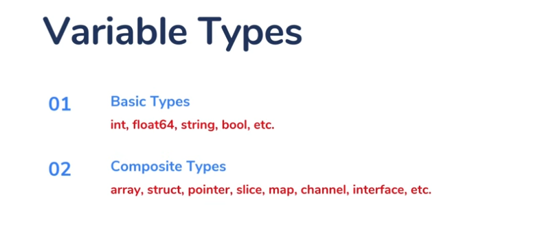
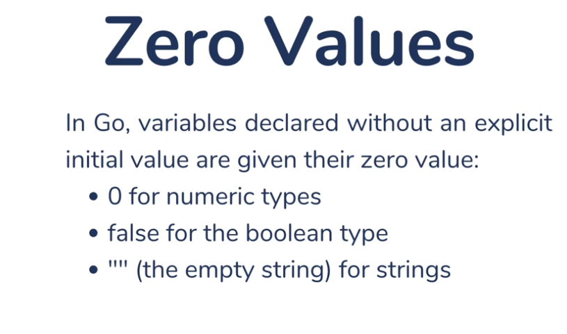
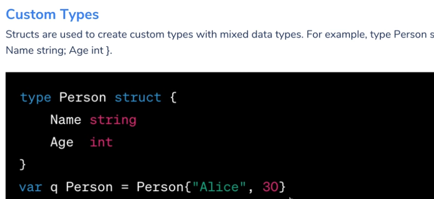
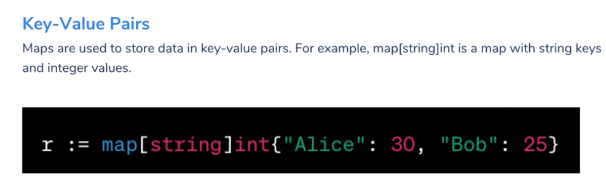
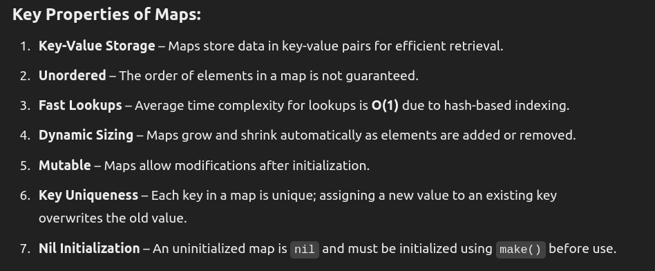
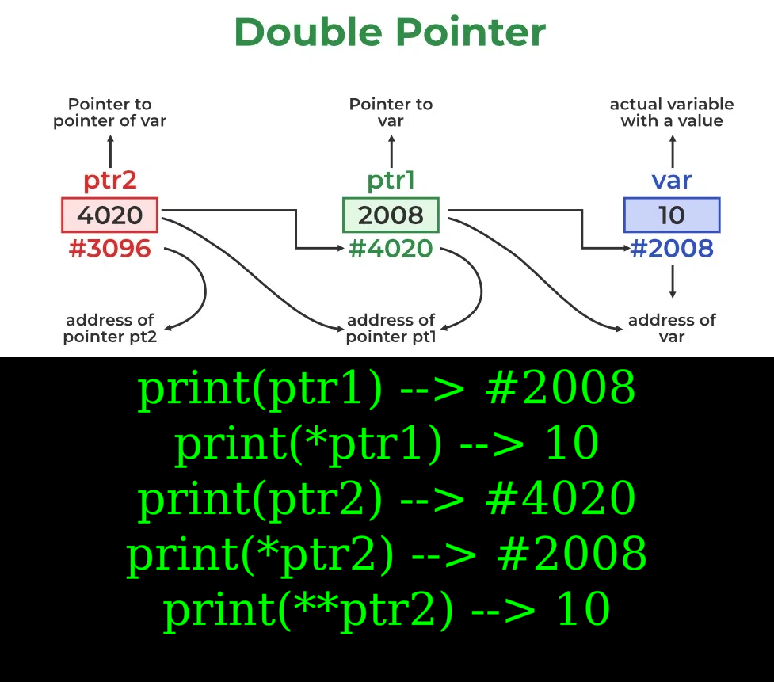

# Go Programming Basics

Welcome to the Go Programming Basics guide! This guide is designed for beginners to help you get started with Go programming. Below, you'll find a comprehensive guide with topics, brief explanations, and references to the code files.

## Table of Contents
1. [Variable Declarations](#variable-declarations)
2. [Arrays and Slices](#arrays-and-slices)
3. [Structs](#structs)
4. [Maps](#maps)
5. [Pointers](#pointers)
6. [Double Pointers](#double-pointers)
7. [Pointer to Struct](#pointer-to-struct)
8. [Ranges](#ranges)

## Introduction to Go
Go, also known as Golang, is an open-source programming language developed by Google. It is designed for simplicity, efficiency, and reliability.

## Variable Declarations
Learn how to declare and initialize variables in Go.

**File:** `vardecl.go`

## Arrays and Slices
Understand the difference between static arrays and dynamic slices in Go.

**File:** `arrayslices.go`

## Structs
Learn how to define and use structs in Go.

**File:** `struct.go`

## Maps
Learn how to create and manipulate maps in Go.
**File:** `map.go`

## Pointers
Understand how to use pointers in Go.

**File:** `pointers.go`

## Double Pointers
Learn how to use double pointers in Go.

**File:** `doublepointers.go`

## Pointer to Struct
Learn how to use pointers with structs in Go.

**File:** `pointrstruct.go`

## Ranges
Learn about the different ranges of data types in Go.

**File:** `ranges.go`

Happy coding with Go!