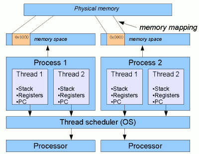
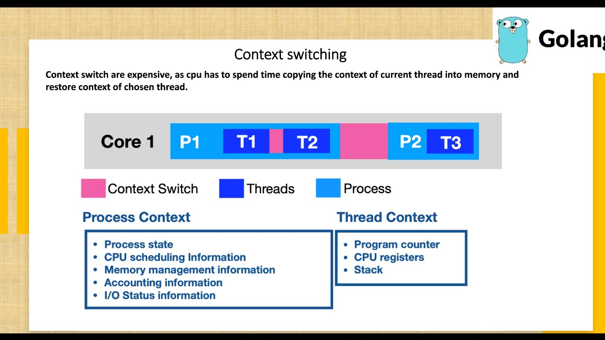
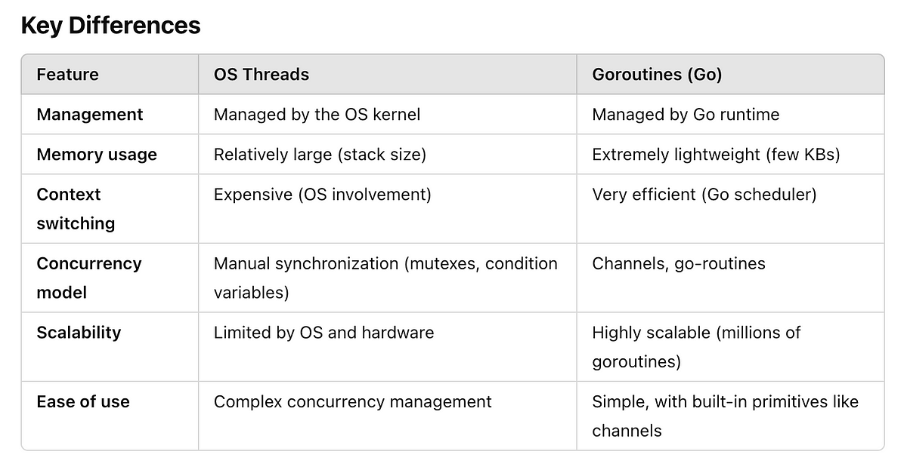
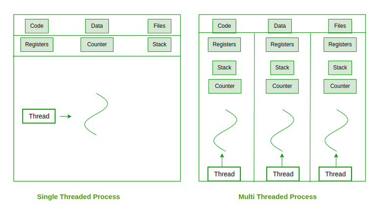
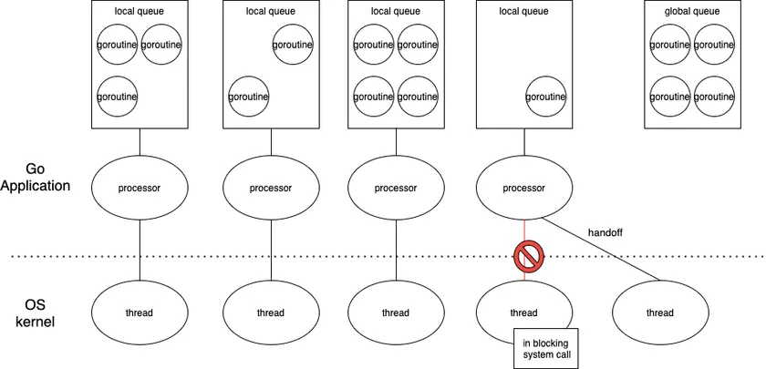
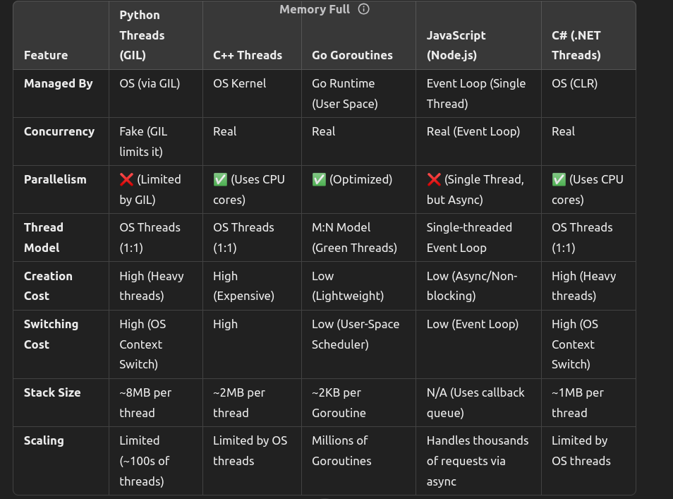
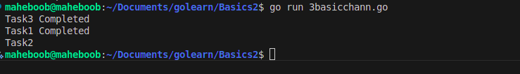
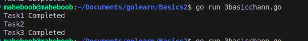
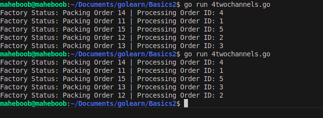

# Go Programming Basics - Advanced Topics

Welcome to the advanced section of the Go Programming Basics guide! This guide is designed for beginners to help you get started with more advanced Go programming concepts. Below, you'll find a comprehensive guide with topics, brief explanations, and references to the code files.

## Table of Contents
1. [Understanding Traditional Program Execution](#understanding-traditional-program-execution)
2. [What are Goroutines?](#what-are-goroutines)
3. [Channels](#channels)

## Prerequisites
**You should have a understanding of OS concepts like exactly what happens when you run a program (e.g simple addition in cpp & when you run a google chrome browser with multiple tabs ):** 

# System Architecture: CPU, Process, Threads, and Memory  

## 📌 Key Concepts  

- **CPU** - Core, Multi-Core, Clock Speed, Cache, Registers  
- **Process** - Foreground Process, Background Process, Zombie Process, Orphan Process  
- **Threads** - User-Level Threads, Kernel-Level Threads, Single-Threaded, Multi-Threaded  
- **Thread Pool** - Worker Threads, Task Queue, Pool Size, Load Balancing  
- **Memory** - Stack Memory, Heap Memory, Virtual Memory, RAM, Paging  
- **Scheduling** - Round Robin, FIFO, Multi-Level Queue, Priority Scheduling  
- **OS Components** - Kernel, System Calls, I/O Management, Process Management, Memory Management  

---
🚀 **Happy Learning!** 😊  


**Terms must known are**


* (https://tech-blog.cymetrics.io/en/posts/genchilu/javas-thread-model-and-golang-goroutine-en/)
* (https://navaneethyv.wordpress.com/2024/01/01/goroutines-and-more/)
* (https://gochronicles.com/concurrency-in-go/)
* (https://youtu.be/4rLW7zg21gI?si=TT51ze0THGgTzNhp)


---

## Understanding Traditional Program Execution

When you run a program in any language, the operating system (OS) and CPU handle its execution in a structured way. Here's what happens:

### 1. **Process Creation**
- The OS creates a **process** to run your program. A process is a container that holds memory, CPU registers, and resources required for execution.

### 2. **Thread Execution**
- A process is assigned at least one **thread** (managed by the OS). This thread executes your program line by line.

### 3. **Synchronous Execution**
  

- When a function is called, the CPU:
  - Pushes a **stack frame** (function variables, return address) onto the call stack.
  - Executes the function instructions.
  - Pops the stack frame when the function returns.
- If a function involves waiting (e.g., `time.Sleep()`), the CPU idles, wasting resources.

### 4. **Context Switching**
- If multiple programs or threads are running, the OS kernel uses **context switching** to share CPU time among them.
- Context switching involves saving and restoring CPU states, which is slow and resource-intensive.




### Example: Traditional Execution (Synchronous)
**File:** [`synch.go`](synch.go)

- Task 1 starts → waits for 2 seconds → completes.
- Task 2 starts → waits for 2 seconds → completes.
- Task 3 starts → waits for 2 seconds → completes.
- **Total time taken = 6 seconds.**





---

## What are Goroutines?

Goroutines are lightweight threads managed by the Go runtime. They allow you to run functions **concurrently**, making your programs faster and more efficient.

### How Goroutines Work
Unlike traditional threads, goroutines are managed by the **Go runtime scheduler**, not the OS. This makes them lightweight and efficient.

Single OS Process, Multiple Goroutines

    Go creates a single process, but inside it, hundreds or thousands of Goroutines can run concurrently.

M:N Scheduler (Goroutine Scheduler)

    Go runtime maps M Goroutines onto N OS threads.

    If a Goroutine is waiting (e.g., due to time.Sleep()), Go automatically schedules another Goroutine onto the same thread without needing a context switch.

Stack Growth Optimization

    Unlike OS threads that start with a big stack (2MB+), Goroutines start with a small stack (~2KB).

    As needed, their stack grows dynamically, making them memory-efficient.

### Key Features of Goroutines
1. **Lightweight:** Goroutines start with a small stack size (~2KB) and grow dynamically, unlike OS threads (~2MB).
2. **Efficient Scheduling:** The Go runtime uses an **M:N scheduler** to map multiple goroutines (M) onto fewer OS threads (N).
3. **No Blocking:** If a goroutine is waiting (e.g., `time.Sleep()`), the Go scheduler assigns another goroutine to the same thread, avoiding idle time.




### Syntax
To create a goroutine, use the `go` keyword:
```go
go myFunction()
```
**File:** [`2withgoroutine.go`](2withgoroutine.go)

```
go func() {
    textBelt <- "Packing Order" // Sending a message
    numberBelt <- 12345         // Sending an order ID
}()
```
✅ func() { ... } is an anonymous function (a function without a name).
❌ This does not define a new named function. Instead, it runs an existing piece of code in the background.
```
go func(<nameofinlinefunction>)
```
is creating and calling an anonymous function (also known as a lambda function or an inline function) inside a goroutine.

**How Commonly Go routines are called in programs**
```
go <existingdefinedfunction>(<paramater1,parameter2>){

}
```


---

## Channels

Channels allow goroutines to communicate safely without using locks.
- **A channel isn't an array—it's more like a passage,pipe or conveyor belt on which goroutines function will travel and communicate with each other:**

### CHANNEL FOLLOWS FIFO PRINCIPLE

Channels do not behave like arrays or lists; they are like conveyor belts that hold data until it's picked up by the receiver.

If you have a channel with 5 items and you start receiving values from it, the first item that was sent to the channel will be the first one to be received. Once it is received, it is removed from the channel, and the next value in the channel becomes the first item available to receive.

### Components of a Channel
1. **Create a Channel:** `ch := make(chan string)`
2. **Send Data:** `ch <- "Hello"`
3. **Receive Data:** `msg := <-ch`

* For more detail understading checkout : (https://youtu.be/5Z8skvm4g64?si=0Lr-nLkEsMhuXjPo)
### Example: Using Channels for Communication

```go
package main

import (
	"fmt"
	"time"
)

// A Worker has task with instructions to be followed of sending string objects
func worker(ch chan string) {
	time.Sleep(2 * time.Second) // Simulating some work (2 sec delay)
	ch <- "Task1 Completed"     // Sending data into the channel (pipe)FIFO channel belt = (task1completed)
	ch <- "Task2" //FIFO channel belt = (task1completed, tastk2)
}

func main() {
	// Creating a channel 'ch' that allows sending and receiving string messages.
	ch := make(chan string) // Think of 'ch' as a pipeline for string data

	// Starting the worker function in a separate goroutine
	go worker(ch) // Calls the object sending worker to work through a channel

	// 'msg is variable' recieves data objects & implicitly becomes a string because 'ch' is a channel for string objects.
	//before this the channel belt will looklike FIFO (task1 completed, task2)
	msg := <-ch
	//after this the channel belt will looklike FIFO (task2)
	msg2 := <-ch
	//after this the channel belt will get empty FIFO ()

	fmt.Println(msg) 	
  fmt.Println(msg2)


}

```
### Output:
```
Task1 Completed
Task2
```
**File:** [`3basicchann.go`](images/3basicchann.go)
**Increase the sleep time to see the magic of different sequence of execution of go routines

### Output 1 with 	time.Sleep(1 * time.Second) // WORKER2 Simulating some work (2 sec delay)



### Output 2 with 	time.Sleep(2 * time.Second) // WORKER2 Simulating some work (2 sec delay)


**File:** [` 4twochannels.go`](4twochannels.go)

### Output



### Channels example

**File:** [`5channlesexample.go`](5channlesexample.go)

Step 1: Starting the Goroutines (Order Processing Workers)
When you run the for loop in main(), it quickly starts 5 goroutines (go processOrder(i, statusChannel)) without waiting for any of them to finish.

The loop executes instantly because go launches a function asynchronously (in the background).
After the loop finishes, all 5 orders are processing in parallel.

💡 Why Does the Output Start with Order 4?
👉 Analogy: Think of it as 5 chefs cooking the same dish, but they each finish at different times!

Although all orders are started at the same time, the Go runtime decides which goroutine gets CPU time first. Since goroutines run concurrently, their completion order is unpredictable.

👉 This is like placing 5 pots on a stove at the same time and some finish cooking before others because of heat distribution!

🚀 Example Flow:

Let’s assume the Go runtime picks Order 4 first to get CPU time.

Then Order 1 starts finishing up.

Order 5 finishes next, and so on.

So, your factory (program) sends the completed orders to the channel whenever they finish.
---

## WAYS TO CALL GO ROUTINE AND GO ROUTINE INLINE/LAMBDA FUNCTION

## Final Takeaways

- **Without Goroutines:**
  - CPU waits during blocking calls.
  - Threads are expensive in memory and slow due to context switching.

- **With Goroutines:**
  - Multiple tasks execute concurrently.
  - Go Scheduler optimizes CPU usage.
  - Lightweight and scalable (millions of goroutines).

---

🚀 Happy coding with Go!